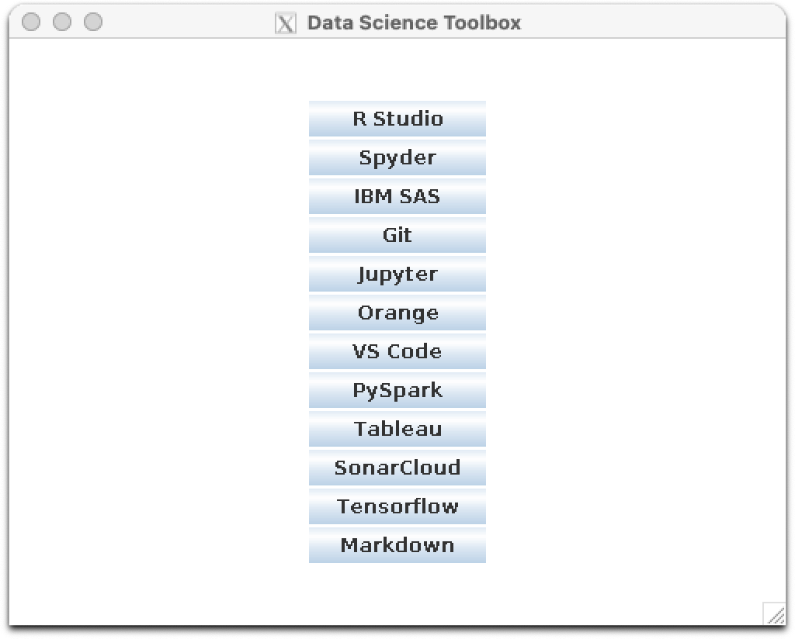

# cs1660-project

## Screenshot of the Main Application

## Usage

### Prerequisite

***Tested it on Mac***

* Docker installed
* socat installed to build a connection between the docker container and xQuartz on the host machine

### Running

1. Open a terminal tab, run:

    > socat TCP-LISTEN:6000,reuseaddr,fork UNIX-CLIENT:\"$DISPLAY\"

2. Open another termial tab, cd to the project directory and then run:

    > docker-compose build

3. In the previous tab, run:

    > docker-compose up -d

4. Once finished, run:

    > docker-compose down

## Demo

### Link

[Demo Video](https://pitt-my.sharepoint.com/:v:/g/personal/ziz36_pitt_edu/Ec-5Yyw-9XRKgK-fCBRAOXkBxDk81EYdbVmAyitwlqHAZA "Demo").

***The backgroud color of my gui app is super dark in this demo video and it's probably something with Filmora***